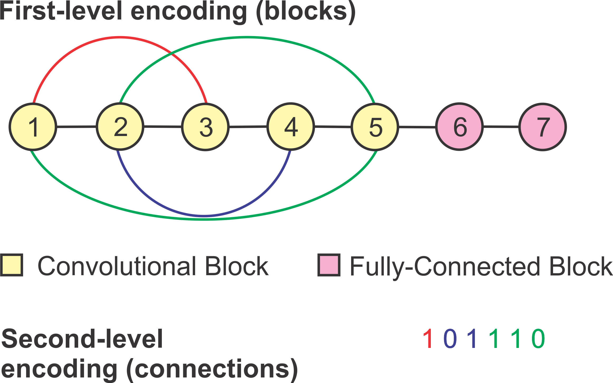

# DeepGA
DeepGA is a novel framework to evolve Convolutional Neural Networks, using a Genetic Algorithm.  

* **Encoding**: the neural encoding in DeepGA is a low-modular, flexible hybrid representation based on convolutional blocks (convolution + optional pooling) and fully connected blocks (linear layers), and binary strings that represent the dense connectivity patterns in the convolutional part of the CNN (as seen in the image below). This encoding is unbiased towards larger CNNs, such as the *Wang encoding*, which is used as the comparative standpoint \(https://link.springer.com/chapter/10.1007/978-3-030-29894-4_52). Also, a series of evolutionary operators (selection, crossover, and mutation) have been designed to deal with this encoding.

* **Fitness**: the single objective version of DeepGA utilizes a linear weighted fitness functions consisting on the accuracy and the number of parameters of the CNN. This aids at searching for CNN architectures with a high classification accuracy and a low number of trainable parameters (weights, biases), based on the user requirements. The Multi-Objective version of DeepGA, on the other hand, takes both the accuracy (or classification error) and the number of parameters of the CNNs directly as two objective functions.
 

